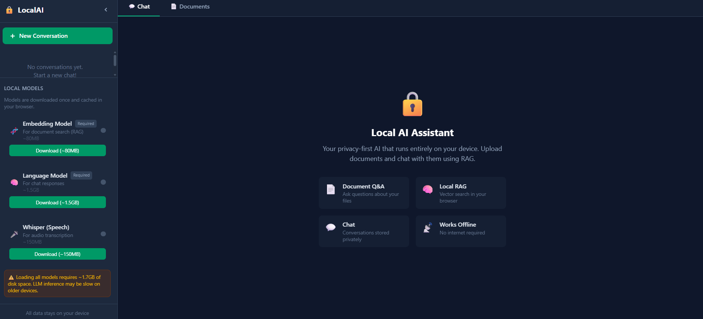

# Local AI Assistant

> **A privacy-first, browser-based AI assistant.** All AI inference runs locally in your browser — no data is sent to any server.

<p align="center">
  
</p>

[](./LICENSE)
[](https://developer.mozilla.org/en-US/docs/Web/Progressive_web_apps)
[](.)
[](.)
[](.)

---

## Table of Contents

- [Overview](#overview)
- [Features](#features)
- [Tech Stack](#tech-stack)
- [Getting Started](#getting-started)
- [Usage Guide](#usage-guide)
- [Architecture](#architecture)
- [Project Structure](#project-structure)
- [Configuration](#configuration)
- [Development](#development)
- [FAQ](#faq)
- [License](#license)

---

## Overview

Local AI Assistant (LocalAI) is a Progressive Web Application (PWA) that brings state-of-the-art AI models — language models, embedding models, vision models, and speech-to-text — directly to your browser using WebAssembly and ONNX runtime. Everything runs client-side using [@xenova/transformers](https://github.com/xenova/transformers.js) and [onnxruntime-web](https://github.com/microsoft/onnxruntime-web).

The app supports **Retrieval-Augmented Generation (RAG)**: upload documents (PDF, TXT, MD, CSV), which are chunked, embedded, and stored in a local vector database (IndexedDB). When you ask a question, the system retrieves the most relevant chunks using hybrid BM25 + vector similarity search and provides them as context to the AI model.

For users with local AI servers, you can connect to [Ollama](https://ollama.com), [LM Studio](https://lmstudio.ai), or any OpenAI-compatible API.

---

## Features

### Core AI

- **In-Browser LLM** — LaMini-Flan-T5, TinyLlama, and Qwen running entirely in your browser via WebAssembly
- **Embedding Model** — all-MiniLM-L6-v2 for semantic search and RAG
- **Whisper Speech-to-Text** — Transcribe audio recordings using Whisper Tiny EN
- **Image Recognition (Vision)** — Upload images and AI describes what's in them (ViT-GPT2)
- **Local Server Mode** — Connect to Ollama or any OpenAI-compatible API
- **Agent Tools** — Calculator (with `^` exponentiation), unit converter, date/time
- **Web Search** — Optional DuckDuckGo integration for current information

### RAG & Documents

- **Upload & Process** — Drag-and-drop or upload PDF, TXT, MD, and CSV files
- **Hybrid Search** — BM25 keyword search + vector similarity re-ranking
- **Vector Database** — Documents chunked (500 chars, 100 overlap), embedded, stored in IndexedDB
- **Document Viewer** — Inline PDF viewer with tag management
- **Source Attribution** — AI responses show which documents were used

### Chat

- **Streaming Responses** — Real-time token-by-token streaming
- **Stop Generation** — Cancel inference mid-response
- **Edit & Regenerate** — Edit messages and regenerate AI responses
- **Image Attachments** — Upload, paste, or drag-drop images that render inline in chat
- **Persistent Memory** — AI remembers facts about you across conversations
- **Smart Replies** — Contextual follow-up suggestions after each response
- **Star / Copy / Delete** — Per-message actions
- **Read Aloud** — 🔊 button reads AI responses using Web Speech API

### Conversation Management

- **Pin / Rename / Archive** — Organize conversations
- **Date Grouping** — Today, Yesterday, This Week, Older
- **In-Chat Search** — Search messages with role filtering (All / User / AI)
- **Export** — Export conversations as JSON or Markdown
- **Share** — Copy as text or download as Markdown

### UI / UX

- **Dark & Light Themes** — Toggle between modes
- **6 Accent Colors** — Emerald, Blue, Violet, Amber, Rose, Cyan
- **Multi-Language** — English, Français, العربية (Arabic RTL support)
- **Markdown Rendering** — Full Markdown with syntax highlighting
- **Markdown Toolbar** — Bold, Italic, Code, Links, Lists, Code Blocks
- **Responsive Design** — Mobile-friendly with collapsible sidebar
- **Loading Skeletons** — Animated placeholders during model loading
- **Toast Notifications** — Non-intrusive success/error messages
- **Error Boundaries** — Graceful error handling with reload option

### PWA

- **Installable** — Works as a standalone desktop/mobile app
- **Offline Support** — Cached assets via service worker
- **Auto-Update** — Service worker auto-updates on new releases

---

## Tech Stack

| Layer            | Technology                                                                                                                                                      | Purpose                                               |
| ---------------- | --------------------------------------------------------------------------------------------------------------------------------------------------------------- | ----------------------------------------------------- |
| **UI Framework** | [React 19](https://react.dev/)                                                                                                                                  | Component rendering                                   |
| **Build Tool**   | [Vite 8](https://vitejs.dev/)                                                                                                                                   | Dev server, bundling                                  |
| **Styling**      | [Tailwind CSS 4](https://tailwindcss.com/) + CSS custom properties                                                                                              | Utility-first styling with dynamic theming            |
| **AI Inference** | [@xenova/transformers](https://github.com/xenova/transformers.js) v2.17                                                                                         | In-browser ML model execution                         |
| **Runtime**      | [onnxruntime-web](https://github.com/microsoft/onnxruntime-web) 1.14                                                                                            | ONNX model runtime                                    |
| **Database**     | [Dexie.js](https://dexie.org/) 4.4                                                                                                                              | IndexedDB wrapper (app data, vectors, images, memory) |
| **Icons**        | [lucide-react](https://lucide.dev/)                                                                                                                             | Consistent SVG icon set                               |
| **Markdown**     | [react-markdown](https://github.com/remarkjs/react-markdown) + [react-syntax-highlighter](https://github.com/react-syntax-highlighter/react-syntax-highlighter) | Message rendering                                     |
| **PDF**          | [pdfjs-dist](https://mozilla.github.io/pdf.js/) 5.7                                                                                                             | PDF text extraction and rendering                     |
| **PWA**          | [vite-plugin-pwa](https://vite-pwa-org.netlify.app/) 1.3                                                                                                        | Service worker, manifest                              |
| **Testing**      | [Vitest](https://vitest.dev/) 4.1 + [Testing Library](https://testing-library.com/)                                                                             | Unit and integration tests                            |
| **E2E Testing**  | [Playwright](https://playwright.dev/)                                                                                                                           | End-to-end and accessibility tests                    |
| **Linting**      | [ESLint](https://eslint.org/) 10                                                                                                                                | Code quality (0 errors)                               |
| **Formatting**   | [Prettier](https://prettier.io/) 3.9                                                                                                                            | Code formatting                                       |
| **Pre-commit**   | [Husky](https://typicode.github.io/husky/) + [lint-staged](https://github.com/lint-staged/lint-staged)                                                          | Auto-lint on commit                                   |

---

## Getting Started

### Prerequisites

- **Node.js** 18+ (recommended: 20+)
- **npm** 9+ (comes with Node.js)

### Installation

```bash
# Clone the repository
git clone https://github.com/Medgabsi99/local-ai-assistant.git
cd local-ai-assistant

# Install dependencies
npm install

# Start the development server
npm run dev
```

The app will be available at `http://localhost:5173`.

### Production Build

```bash
# Build for production
npm run build

# Preview the production build locally
npm run preview
```

---

## Usage Guide

### Downloading AI Models

When you first open the app, open the sidebar to see the model status panels. You need to download at least these:

1. **Embedding Model** (all-MiniLM-L6-v2, ~80MB) — Required for RAG and semantic search
2. **Language Model** (LaMini-Flan-T5-783M, ~1.5GB) — Required for chat
3. **Whisper** (optional, ~150MB) — Required for audio transcription
4. **Image Understanding** (optional, ~600MB) — Required for AI to describe images

> **Note:** Language models are large (700MB–1.5GB). First download may take several minutes.

### Chatting with RAG

1. **Enable RAG Mode** — Toggle in the chat top bar
2. **Upload Documents** — Switch to the "Documents" tab and upload files
3. **Ask Questions** — The AI retrieves relevant chunks and answers based on them

```
Upload → Extract text → Chunk (500 char) → Embed → Store in IndexedDB
Query → Embed query → Search similar vectors → BM25 re-rank → Context → LLM → Answer
```

### Image Recognition

1. Download the **Image Understanding** model (sidebar → Image Understanding → Download)
2. Click the **📷 icon** next to the chat input
3. Select an image or paste from clipboard (Ctrl+V)
4. The AI describes what's in the picture

You can also **drag and drop** images directly onto the chat area.

### Persistent Memory

The AI remembers facts you tell it across conversations:

- "My name is John" → remembers your name
- "I love Python" → remembers your preferences
- Next conversation: "What do I like?" → "You love Python!"

### Smart Replies

After the AI responds, up to 3 contextual follow-up suggestions appear as pill buttons. Click one to fill the input instantly.

### Connecting to Ollama

1. Open **Settings** (gear icon in sidebar)
2. Enable **Local LLM Server**
3. Enter `http://localhost:11434` and model name (e.g., `llama3.2:1b`)
4. Click **Test** to verify

### Audio Transcription

1. Click the **microphone button** next to the input
2. Grant microphone permission
3. Speak → Click **Stop**
4. Transcribed text appears in the input

Requires **Whisper** model.

### Conversation Management

| Action              | How                                       |
| ------------------- | ----------------------------------------- |
| **New Chat**        | Click `+` or press `⌘N`                   |
| **Pin**             | Hover conversation → pin icon             |
| **Rename**          | Hover → pencil icon                       |
| **Archive**         | Hover → archive icon                      |
| **Delete**          | Hover → trash icon                        |
| **Export JSON**     | Hover → download icon                     |
| **Search Messages** | `⌘F` or search icon in top bar            |
| **Share**           | Share icon → copy or download as Markdown |

---

## Architecture

### Component Tree

```
App (ErrorBoundary)
├── LangContext.Provider
│   └── ModelStatusContext.Provider
│       └── ToastProvider
│           └── Layout
│               ├── Sidebar
│               │   ├── ConversationList
│               │   └── ModelStatus
│               ├── [ChatArea / DocumentPane]
│               └── SettingsModal
```

### Data Flow

```
User Input → ChatArea
  → useChatSend hook
    → [RAG Mode] searchSimilar() → Vector Store → getEmbeddingsBatch
    → [Agent Mode] detectTool() → executeTool()
    → [Web Search] searchWeb()
    → [Server Mode] llm-server generate()
    → [Browser Mode] ai.runInference() → ai.worker.js
  → addMessage() → IndexedDB
  → Streaming tokens → UI update via onToken
```

### Worker Architecture

```
Main Thread                    Workers
┌─────────────┐               ┌────────────────┐
│ ChatArea    │──message──▶   │ ai.worker.js   │
│             │◀──response──  │ • Model loading │
│ worker-     │               │ • Inference     │
│ bridge.js   │               │ • Embeddings    │
│             │               │ • Transcription │
│             │               │ • TTS synthesis │
│             │               │ • Caption image │
│             │               └────────────────┘
│             │               ┌────────────────┐
│             │──message──▶   │ code-runner    │
│             │◀──response──  │ .worker.js     │
│             │               │ • Sandboxed JS │
│             │               └────────────────┘
│             │               ┌────────────────┐
│             │──message──▶   │ audio-         │
│             │◀──response──  │ processor.js   │
│             │               │ • Recording    │
│             └─────────────┘ └────────────────┘
```

Messages are passed via `worker-bridge.js` using a Promise-based request/response pattern with request IDs.

---

## Project Structure

```
local-ai-assistant/
├── public/                    # Static assets (favicon, icons, offline page, SW)
├── screenshots/               # App screenshots
├── src/
│   ├── App.jsx                # Root component with contexts (Lang, Toast, ModelStatus)
│   ├── main.jsx               # Entry point, CSP, SW registration
│   ├── index.css              # Tailwind + CSS custom properties for theming
│   ├── contexts.jsx           # React contexts (Lang, Toast, ModelStatus)
│   │
│   ├── components/            # React UI components
│   │   ├── ChatArea.jsx       # Main chat: messages, input, image upload, drag-drop
│   │   ├── ChatTopBar.jsx     # Top bar: RAG toggle, web search, theme, agent mode
│   │   ├── MarkdownImage.jsx  # Custom image renderer that resolves img:ID from IndexedDB
│   │   ├── SearchBar.jsx      # In-chat search with role filtering
│   │   ├── SystemPromptEditor.jsx
│   │   ├── TemplatesPanel.jsx
│   │   ├── ShareModal.jsx     # Share/export modal
│   │   ├── AudioRecorder.jsx  # Voice recording + Whisper transcription
│   │   ├── Sidebar.jsx        # Conversation list, search, model status
│   │   ├── SettingsModal.jsx  # Language, accent, storage, LLM server config
│   │   ├── DocumentPane.jsx   # Document management (upload, view, tags)
│   │   ├── PdfViewer.jsx      # Inline PDF viewer
│   │   ├── ModelStatus.jsx    # Model download/load/unload cards
│   │   ├── VectorStoreManager.jsx  # Vector index admin
│   │   ├── InstallPrompt.jsx  # PWA install prompt
│   │   └── ErrorBoundary.jsx  # Error boundary with i18n
│   │
│   ├── hooks/                 # Custom React hooks
│   │   ├── useChatSend.js     # Chat send/generate with memory extraction
│   │   ├── useMessageSearch.js
│   │   ├── useRAG.js          # Document processing, embedding, search, image capture
│   │   ├── useSettings.js
│   │   ├── useSmartReplies.js # Contextual follow-up suggestions
│   │   ├── useImageAttachments.js  # Drag-drop, paste, preview, IndexedDB storage
│   │   ├── useConversationSearch.js
│   │   ├── useOnlineStatus.js
│   │   └── usePWAInstall.js
│   │
│   ├── lib/                   # Utilities
│   │   ├── i18n.js            # 155+ keys across EN/FR/AR
│   │   ├── constants.js
│   │   ├── security.js        # XSS sanitization, CSP, rate limiting
│   │   ├── error-handler.js
│   │   ├── hybrid-search.js   # BM25 + vector similarity hybrid search
│   │   ├── agent-tools.js     # Calculator, converter, datetime
│   │   ├── web-search.js      # DuckDuckGo API
│   │   ├── llm-server.js      # Ollama/OpenAI-compatible API
│   │   └── vector-store-access.js
│   │
│   ├── workers/               # Web Workers
│   │   ├── ai.worker.js       # AI inference, embeddings, TTS, vision
│   │   ├── worker-bridge.js   # Async message passing bridge
│   │   ├── code-runner.worker.js  # Sandboxed JS execution
│   │   ├── audio-processor.js # Audio recording
│   │   ├── pdf-extractor.js   # PDF text extraction
│   │   └── vector-store.js    # Vector storage (HNSW index in IndexedDB)
│   │
│   ├── db/                    # Database
│   │   ├── database.js        # Dexie schema: conversations, messages, docs, settings
│   │   ├── memory.js          # Multi-session persistent memory
│   │   └── image-store.js     # Image attachment storage
│   │
│   └── __tests__/             # Test files (88 tests)
│       ├── agent-tools.test.js     # 21 tests
│       ├── bug-regression.test.js  # 14 regression tests
│       ├── hybrid-search.test.js   # 9 tests
│       ├── i18n.test.js           # 10 tests
│       ├── database.test.js       # 4 tests
│       ├── llm-server.test.js     # 9 tests
│       ├── vector-store.test.js   # 11 tests
│       ├── integration.test.jsx   # 7 tests (components + i18n)
│       └── chat-area.test.jsx     # 3 tests
│
├── e2e/                       # Playwright E2E tests
│   └── chat.spec.js           # Basic chat E2E test
│
├── .husky/pre-commit          # Auto-format & lint on commit
├── eslint.config.js           # ESLint (0 errors, 4 intentional warnings)
├── vite.config.js             # Vite + Vitest config
├── package.json               # Dependencies, scripts, lint-staged
└── README.md                  # This file
```

---

## Configuration

### Environment Variables

No required environment variables. All configuration is through the Settings UI or `src/lib/constants.js`.

### Key Constants (`src/lib/constants.js`)

| Constant                      | Default | Description                       |
| ----------------------------- | ------- | --------------------------------- |
| `INFERENCE_MAX_TOKENS`        | 512     | Max tokens for browser inference  |
| `INFERENCE_TEMPERATURE`       | 0.3     | Temperature for browser inference |
| `INFERENCE_SERVER_MAX_TOKENS` | 2048    | Max tokens for server inference   |
| `CHUNK_SIZE`                  | 500     | Document chunk size (characters)  |
| `RAG_TOP_K`                   | 3       | Top-K results for RAG             |
| `SCROLL_THRESHOLD_PX`         | 80      | Auto-scroll threshold             |

---

## Development

### Scripts

| Script    | Command           | Description               |
| --------- | ----------------- | ------------------------- |
| `dev`     | `npm run dev`     | Start dev server with HMR |
| `build`   | `npm run build`   | Production build          |
| `test`    | `npm test`        | Run all 88 tests          |
| `lint`    | `npm run lint`    | ESLint check              |
| `format`  | `npm run format`  | Prettier format all files |
| `prepare` | `npm run prepare` | Initialize Husky hooks    |

### Pre-commit Hook

Every `git commit` automatically runs:

1. `eslint --fix` on `.js`/`.jsx` files
2. `prettier --write` for formatting

### Testing

```bash
# Run all tests (88 passing)
npm test

# Run in watch mode
npm run test:watch

# Run a specific file
npx vitest run src/__tests__/agent-tools.test.js

# E2E tests
npx playwright test
```

### Building

```bash
npm run build  # Output in dist/
```

The production build includes:

- Minified JS with tree-shaking
- CSS extraction and minification
- Service worker with asset caching (versioned)
- PWA manifest and offline page
- Optimized WASM modules for ONNX runtime

---

## FAQ

### Does this app send my data anywhere?

**No.** All AI inference runs locally. External requests are only:

- Model downloads (from Hugging Face CDN)
- Web search (if enabled, DuckDuckGo API)
- Local Ollama server (if enabled, to your machine)

### How much RAM does it need?

- **Embedding Model**: ~200MB
- **Language Model (LaMini)**: ~1.5GB
- **Language Model (TinyLlama)**: ~700MB
- **Whisper**: ~150MB
- **Vision Model**: ~600MB

### Which browsers are supported?

- **Chrome** 100+ (best WASM performance)
- **Edge** 100+
- **Firefox** 110+
- **Safari** 16+ (limited PWA)

### How are my images stored?

Images are stored as base64 data URLs in a dedicated IndexedDB database (`LocalAIImages`). They persist across page refreshes and are referenced from messages using `img:ID` syntax.

### Can I clear all data?

Yes — **Settings → Clear All Data**. This deletes all IndexedDB databases, clears caches, and unloads models. A page reload is required.

---

## License

[MIT](./LICENSE) — Free for personal and commercial use.

---

_Built with ❤️ by [Medgabsi99](https://github.com/Medgabsi99)_

---

## Badges

[](./LICENSE)
[](https://developer.mozilla.org/en-US/docs/Web/Progressive_web_apps)
[](.)
[](.)
[](.)
[](.)
